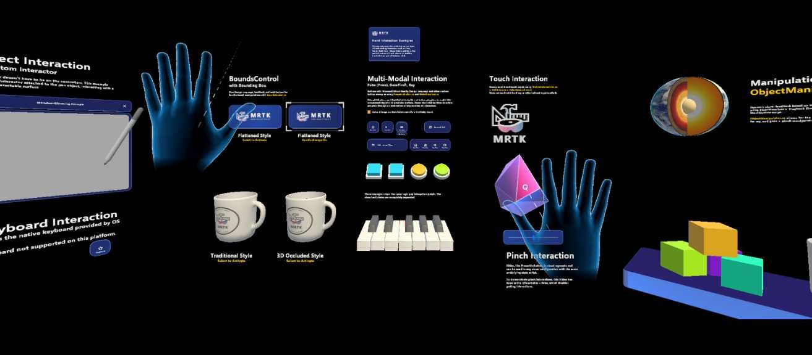

# MRTK Sample for DigiLens Argo glasses

This sample use the original MRTK "Hand Interaction" example scene and is built on top of Snapdragon Spaces SDK (using OpenXR)

# Downlaod and Install the APK
The APK is already build and available in [Releases](https://github.com/VincentGuigui/DigiLens-MRTKSample/releases)
You can install it using ADB:
`adb install DigiLens.MRTKSample.apk`

# Requirements

- DigiOS Software Build B1.0001.2129 

- Unity Editor version 2022.3.62f3

- Snapdragon Spaces Unity SDK v1.0.1 

- Microsoft Mixed Reality Toolkit 3.0

# Instructions for Building
1. Download [Unity Hub](https://unity.com/download)
2. Install editor version [2022.3.62f3](https://unity.com/releases/editor/archive) with Android Build support
3. Download and unzip the [Snapdragon Spaces Unity SDK](https://spaces.qualcomm.com/developer/ar-sdk/#downloads) v1.0.1
4. Open the project 
5. Build Settings : switch to Android as the build platform
6. Package Manager: Add package from tarball : com.qualcomm.snapdragon.spaces-1.0.1.tgz
7. Install [Mixed Reality Toolkit Feature Tool](https://learn.microsoft.com/fr-fr/windows/mixed-reality/develop/unity/welcome-to-mr-feature-tool) and install all MRTK 3.0 components
8. Project Settings/XR Plug-in Management: Ensure OpenXR/Snapdragon Spaces features group is enabled
8. Project Settings/XR Plug-in Management/OpenXR: Ensure Base Runtime and Hand Tracking Subsystem are enabled 
7. Build and run the Spaces Sample scene

# Additional Resources

DigiLens : [Developing with MRTK 3.0](https://developer.digilens.com/hc/en-us/articles/33973966615323-MRTK-3-0) page.

DigiLens : [Developing with Snapdragon Spaces 1.0.1](https://developer.digilens.com/hc/en-us/articles/36241428293659-Developing-for-Snapdragon-Spaces-1-0-1) page.
